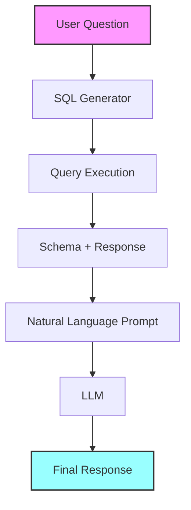

------
<!--- markdown-next --->
# Building a Text-to-SQL Application with LangChain and qwen2.5

This tutorial demonstrates how to build a natural language to SQL query converter using LangChain and qwen2.5. We'll cover:

* Setting up a local LLM for data privacy
* Creating SQL queries from natural language
* Adding conversational memory for context awareness
* Building a complete question-answering system

## Key Features
* 🔒 Privacy-focused: Uses local LLMs
* 💬 Natural language interface
* 🤖 Conversational memory
* 🗃️ SQL database integration
 
* Familiarity with LLMs

------
<!--- code-next --->
```python
# Install required packages
! pip install langchain langchain-ollama
```

------
<!--- markdown-next --->
## LLM Setup

We'll use two options for accessing qwen2.5:

1. **Local Deployment (Recommended for Privacy)**:
   * Uses Ollama for local model hosting
   * Requires local installation
   * Full data privacy

2. **API Access (Alternative)**:
   * Uses DeepInfra API
   * No local setup needed
   * Data leaves your system

------
<!--- code-next --->
```python
# Configure LLM options
#from langchain_community.chat_models import ChatOllama
from langchain_ollama import ChatOllama

from langchain_community.llms import DeepInfra

# Local LLM setup
local_model = ChatOllama(model="qwen2.5:14b")

# API setup (optional)
deepinfra_model = "meta-llama/Meta-Llama-3.1-70B-Instruct"
api_model = None ### 
# https://api.python.langchain.com/en/latest/llms/langchain_community.llms.deepinfra.DeepInfra.html

# Choose which model to use
llm = local_model  # Switch to api_model if using Replicate


```

------
<!--- markdown-next --->
## Database Connection

We'll use a sample NBA database for this tutorial. The database contains player rosters and salary information.

Download the database from: https://github.com/meta-llama/llama-recipes/raw/refs/heads/main/recipes/use_cases/coding/text2sql/nba_roster.db

------
<!--- code-next --->
```python
from langchain_community.utilities import SQLDatabase

# Initialize database connection
db = SQLDatabase.from_uri("sqlite:///nba_roster.db", sample_rows_in_table_info=0)

# Helper functions
def get_schema(_):
    """Retrieve database schema"""
    return db.get_table_info()

def run_query(query):
    """Execute SQL query"""
    return db.run(query)
```

------
<!--- code-next --->
```python
print(get_schema(_))
```

<!--- code-out#0001 --->

------
<!--- markdown-next --->
## Building the Query Generator

We'll create a system that:
1. Takes natural language input
2. Converts it to SQL
3. Executes the query
4. Returns human-readable results

Key components:
* Prompt templates for SQL generation
* Query execution chain
* Natural language response formatting

------
<!--- code-next --->
```python
from langchain_core.prompts import ChatPromptTemplate
from langchain_core.output_parsers import StrOutputParser
from langchain_core.runnables import RunnablePassthrough

# SQL generation prompt
sql_prompt_template = """Based on the table schema below, write a SQL query that would answer the user's question:
{schema}

Question: {question}
SQL Query:"""

prompt = ChatPromptTemplate.from_messages([
    ("system", "Given an input question, convert it to a SQL query. No pre-amble."),
    ("human", sql_prompt_template),
])

# Build query generation chain
sql_generator = (
    RunnablePassthrough.assign(schema=get_schema)
    | prompt
    | llm.bind(stop=["\nSQLResult:"])
    | StrOutputParser()
)
```

------
<!--- markdown-next --->
## Adding Natural Language Responses

Let's make the system more user-friendly by converting SQL results back to natural language.

------
<!--- code-next --->
```python
# Natural language response generation
response_template = """Based on the table schema below, question, sql query, and sql response, write a natural language response:
{schema}

Question: {question}
SQL Query: {query}
SQL Response: {response}"""

nl_prompt = ChatPromptTemplate.from_messages([
    ("system", "Given an input question and SQL response, convert it to a natural language answer. No pre-amble."),
    ("human", response_template),
])

# Complete chain with natural language output
complete_chain = (
    RunnablePassthrough.assign(query=sql_generator)
    | RunnablePassthrough.assign(
        schema=get_schema,
        response=lambda x: db.run(x["query"]),
    )
    | nl_prompt
    | llm
)


```

------
<!--- markdown-next --->
## Understanding the Complete Chain

Let's break down the complete chain that transforms natural language to SQL and back to natural language:

```python
complete_chain = (
    RunnablePassthrough.assign(query=sql_generator)
    | RunnablePassthrough.assign(
        schema=get_schema,
        response=lambda x: db.run(x["query"]),
    )
    | nl_prompt
    | llm
)
```

------
<!--- markdown-next --->
### Chain Components Breakdown

1. **Initial Input**
   * The chain starts with a dictionary containing the user's question:
   ```python
   {"question": "What team is Klay Thompson on?"}
   ```

2. **First RunnablePassthrough.assign**
   ```python
   RunnablePassthrough.assign(query=sql_generator)
   ```
   * Takes the input dictionary
   * Adds a new 'query' key with SQL generated by sql_generator
   * Result looks like:
   ```python
   {
       "question": "What team is Klay Thompson on?",
       "query": "SELECT team FROM players WHERE name = 'Klay Thompson'"
   }
   ```

3. **Second RunnablePassthrough.assign**
   ```python
   RunnablePassthrough.assign(
       schema=get_schema,
       response=lambda x: db.run(x["query"])
   )
   ```
   * Adds two new keys to the dictionary:
     * 'schema': Database structure from get_schema()
     * 'response': Result from executing the SQL query
         * x will be previouse json output:
         ```python
         {
            "question": "What team is Klay Thompson on?",
            "query": "SELECT team FROM players WHERE name = 'Klay Thompson'"
         }
         ```
      
         * So x["query"] is the sql query

   * Result looks like:
   ```python
   {
       "question": "What team is Klay Thompson on?",
       "query": "SELECT team FROM players WHERE name = 'Klay Thompson'",
       "schema": "CREATE TABLE players (name TEXT, team TEXT, ...)",
       "response": "Golden State Warriors"
   }
   ```

4. **Natural Language Prompt**
   ```python
   nl_prompt
   ```
   * Takes all dictionary values
   * Formats them into a prompt for the LLM
   * Example prompt:
   ```text
   Based on the table schema below, question, sql query, and sql response, write a natural language response:
   
   Schema: CREATE TABLE players (name TEXT, team TEXT, ...)
   Question: What team is Klay Thompson on?
   SQL Query: SELECT team FROM players WHERE name = 'Klay Thompson'
   SQL Response: Golden State Warriors
   ```

5. **Final LLM Processing**
   ```python
   llm
   ```
   * Takes the formatted prompt
   * Generates natural language response
   * Final output example:
   ```text
   "Klay Thompson plays for the Golden State Warriors."
   ```

### Visual Flow Diagram


 
 
### Example with Complete Chain

Here's a complete example showing the transformation at each step:


```python

def demonstrate_chain_steps(question: str):
    """
    Demonstrate each step of the complete chain
    
    Args:
        question (str): Natural language question
    """
    print("\n=== Chain Demonstration ===\n")
    
    # Step 1: Initial input
    print("1. Initial Input:")
    print({"question": question})
    
    # Step 2: Generate SQL
    sql = sql_generator.invoke({"question": question})
    print("\n2. Generated SQL:")
    print(sql)
    
    # Step 3: Execute SQL
    db_result = db.run(sql)
    print("\n3. Database Result:")
    print(db_result)
    
    # Step 4: Get schema
    schema = get_schema(None)
    print("\n4. Database Schema:")
    print(schema[:200] + "...")  # Truncated for readability
    
    # Step 5: Complete response
    final_response = complete_chain.invoke({"question": question})
    print("\n5. Final Natural Language Response:")
    print(final_response)
    
    print("\n=== End Demonstration ===\n")

# Example usage
demonstrate_chain_steps("What team is Klay Thompson on?")

```

<!--- code-out#0003 --->

------
<!--- markdown-next --->


### Key Points About the Chain

1. **Data Persistence**:
   * Each step in the chain preserves previous data
   * New keys are added to the existing dictionary
   * Original question remains available throughout

2. **Error Handling**:
   * Each step can potentially fail
   * Add try/except blocks in production
   * Monitor chain performance

3. **Customization Options**:
   * Replace any component with custom implementation
   * Add additional steps as needed
   * Modify prompts for different output styles

4. **Performance Considerations**:
   * Chain executes sequentially
   * Most time-consuming steps:
     * SQL generation (LLM)
     * Database query
     * Natural language generation (LLM)

------
<!--- markdown-next --->
## Adding Conversational Memory

To make our system context-aware, we'll add memory to track conversation history. This allows for:
* Follow-up questions
* Context retention
* More natural interactions

------
<!--- code-next --->
```python
from langchain.memory import ConversationBufferMemory
from langchain_core.prompts import MessagesPlaceholder

# Initialize memory
memory = ConversationBufferMemory(return_messages=True)

# Updated prompt with memory
memory_prompt = ChatPromptTemplate.from_messages([
    ("system", "Convert questions to SQL using schema: {schema}"),
    MessagesPlaceholder(variable_name="history"),
    ("human", "{question}"),
])

# Memory-enabled query chain
def save_context(input_output):
    """Save conversation context"""
    output = {"output": input_output.pop("output")}
    memory.save_context(input_output, output)
    return output["output"]

sql_chain_with_memory = (
    RunnablePassthrough.assign(
        schema=get_schema,
        history=lambda x: memory.load_memory_variables(x)["history"],
    )
    | memory_prompt
    | llm.bind(stop=["\nSQLResult:"])
    | StrOutputParser()
)

# Final chain with memory
sql_memory_chain = RunnablePassthrough.assign(output=sql_chain_with_memory) | save_context


```

------
<!--- markdown-next --->
## Usage Examples

Try these sample questions:

------
<!--- code-next --->
```python
# Basic query
response = complete_chain.invoke({"question": "What team is Klay Thompson on?"})


```

------
<!--- markdown-next --->
## Result Handling

LangChain chains return different types of output depending on their configuration. Here's how to handle and display results:

### Basic Result Printing
The simplest way to see results is using Python's print function:

------
<!--- code-next --->
```python
print(response)  # Prints the natural language response

# For more detailed output, you can print each step:
result = sql_generator.invoke({"question": "What team is Klay Thompson on?"})
print("Generated SQL:", result)
query_result = db.run(result)
print("Database Result:", query_result)
```

<!--- code-out#0004 --->

------
<!--- markdown-next --->
### Formatted Output Function

For cleaner output presentation, we can create a helper function:

------
<!--- code-next --->
```python
def display_query_result(question, include_sql=False):
    """
    Display query results in a formatted way
    
    Args:
        question (str): Natural language question
        include_sql (bool): Whether to show the generated SQL
    """
    # Generate SQL and get response
    sql = sql_generator.invoke({"question": question})
    response = complete_chain.invoke({"question": question})
    
    # Print formatted output
    print("\n" + "="*50)
    print(f"Question: {question}")
    if include_sql:
        print(f"\nGenerated SQL:\n{sql}")
    print(f"\nAnswer: {response}")
    print("="*50 + "\n")

# Example usage
display_query_result("What team is Klay Thompson on?", include_sql=True)
```

<!--- code-out#0005 --->

------
<!--- markdown-next --->
### Working with Memory Chain Results

When using the memory-enabled chain, you might want to track the conversation:

------
<!--- code-next --->
```python
def display_conversation():
    """Display the current conversation history"""
    history = memory.load_memory_variables({})["history"]
    print("\nConversation History:")
    print("="*50)
    for msg in history:
        role = "Human" if msg.type == "human" else "Assistant"
        print(f"{role}: {msg.content}\n")

# Example conversation
response1 = sql_memory_chain.invoke({"question": "What team is Klay Thompson on?"})
print("First Response:", response1)

response2 = sql_memory_chain.invoke({"question": "What is his salary?"})
print("Follow-up Response:", response2)

display_conversation()
 


```

<!--- code-out#0006 --->

------
<!--- markdown-next --->
### Tips for Result Handling

* Always validate the response before using it in your application
* Consider adding error handling for cases when the query fails
* Format numbers and dates in the output for better readability
* Store important results for later use
* Log queries and responses for debugging purposes

Example error handling wrapper:

------
<!--- code-next --->
```python
def safe_query(question):
    """
    Safely execute a query with error handling
    
    Args:
        question (str): Natural language question
    Returns:
        dict: Result and status
    """
    try:
        response = complete_chain.invoke({"question": question})
        return {
            "success": True,
            "response": response
        }
    except Exception as e:
        return {
            "success": False,
            "error": str(e)
        }

# Example usage
result = safe_query("What team is Klay Thompson on?")
if result["success"]:
    print("Answer:", result["response"])
else:
    print("Error:", result["error"])


```

<!--- code-out#0007 --->

------
<!--- markdown-next --->
## Next Steps
* Implement input validation
* Add query optimization
* Create a user interface
* Add database write capabilities

Remember to always validate and sanitize user inputs when working with databases!

------
<!--- markdown-next --->
## Input Validation and Sanitization

Security is crucial when working with databases. Here's a comprehensive approach to validate and sanitize user inputs:

Key security considerations:
* Prevent SQL injection
* Validate input types and formats
* Limit query complexity
* Restrict access to sensitive data
* Log suspicious activities

### Input Validation Implementation

------
<!--- code-next --->
```python
import re
from typing import Dict, Optional, List
from datetime import datetime

class InputValidator:
    """Input validation and sanitization for database queries"""
    
    # Restricted words that might indicate harmful queries
    RESTRICTED_WORDS = {
        'delete', 'drop', 'truncate', 'update', 'insert', 
        'alter', 'create', 'replace', 'modify', 'grant'
    }
    
    # Allowed table names from our database
    ALLOWED_TABLES = {'nba_roster'}  # Updated to match actual database table
    
    def __init__(self):
        self.error_messages = []
    
    def validate_question(self, question: str) -> bool:
        """
        Validate a natural language question
        
        Args:
            question (str): User's input question
            
        Returns:
            bool: True if valid, False otherwise
        """
        self.error_messages = []
        
        # Check if question is empty or too long
        if not question or not question.strip():
            self.error_messages.append("Question cannot be empty")
            return False
            
        if len(question) > 500:
            self.error_messages.append("Question is too long (max 500 characters)")
            return False
        
        # Check for basic SQL injection attempts
        question_lower = question.lower()
        if any(word in question_lower for word in self.RESTRICTED_WORDS):
            self.error_messages.append("Question contains restricted keywords")
            return False
        
        # Check for excessive special characters
        if re.search(r'[;{}()\\]', question):
            self.error_messages.append("Question contains invalid characters")
            return False
            
        return True
    
    def get_error_messages(self) -> List[str]:
        """Get all error messages from validation"""
        return self.error_messages


```

------
<!--- markdown-next --->
### Query Result Validator

We also need to validate the generated SQL before execution:

------
<!--- code-next --->
```python
# Add this method to the QueryValidator class:


class QueryValidator:
    """Validate generated SQL queries before execution"""
    
    def __init__(self, db_connection):
        self.db = db_connection
        self.error_messages = []
    def get_error_messages(self) -> List[str]:
        """Get all error messages from validation"""
        return self.error_messages

    def validate_sql(self, sql: str) -> bool:
        """
        Validate generated SQL query
        
        Args:
            sql (str): Generated SQL query
            
        Returns:
            bool: True if valid, False otherwise
        """
        sql_lower = sql.lower()
        
        # Check if query is read-only (SELECT only)
        if not sql_lower.strip().startswith('select'):
            self.error_messages.append("Only SELECT queries are allowed")
            return False
        
        # Check for multiple statements
        if ';' in sql[:-1]:  # Allow semicolon at the end
            self.error_messages.append("Multiple SQL statements are not allowed")
            return False
        
        # Validate table names
        tables = self._extract_table_names(sql_lower)
        if not all(table in InputValidator.ALLOWED_TABLES for table in tables):
            self.error_messages.append("Query contains invalid table names")
            return False
            
        return True
    
    def _extract_table_names(self, sql: str) -> set:
        """Extract table names from SQL query"""
        # Simple regex to extract table names
        # Note: This is a basic implementation
        from_matches = re.findall(r'from\s+([a-zA-Z_][a-zA-Z0-9_]*)', sql)
        join_matches = re.findall(r'join\s+([a-zA-Z_][a-zA-Z0-9_]*)', sql)
        return set(from_matches + join_matches)


```

------
<!--- markdown-next --->
### Safe Query Execution Wrapper

Here's how to put it all together in a safe query execution wrapper:

------
<!--- code-next --->
```python
class SafeQueryExecutor:
    """Safe execution of natural language queries"""
    
    def __init__(self, db_connection, llm_chain):
        self.input_validator = InputValidator()
        self.query_validator = QueryValidator(db_connection)
        self.db = db_connection
        self.chain = llm_chain
        
    def execute_safe_query(self, question: str) -> Dict:
        """
        Safely execute a natural language query
        
        Args:
            question (str): User's natural language question
            
        Returns:
            dict: Query result and status
        """
        # Validate input
        if not self.input_validator.validate_question(question):
            return {
                'success': False,
                'error': self.input_validator.get_error_messages(),
                'query': None,
                'result': None
            }
        
        try:
            # Generate SQL query
            sql_query = sql_generator.invoke({"question": question})
            
            # Validate generated SQL
            if not self.query_validator.validate_sql(sql_query):
                return {
                    'success': False,
                    'error': self.query_validator.get_error_messages(),
                    'query': sql_query,
                    'result': None
                }
            
            # Execute query
            result = complete_chain.invoke({"question": question})
            
            return {
                'success': True,
                'error': None,
                'query': sql_query,
                'result': result
            }
            
        except Exception as e:
            return {
                'success': False,
                'error': [str(e)],
                'query': None,
                'result': None
            }


```

------
<!--- markdown-next --->
### Usage Example

Here's how to use the safe query execution system:

------
<!--- code-next --->
```python
# Initialize the safe executor
safe_executor = SafeQueryExecutor(db, complete_chain)

# Example queries
def test_queries():
    # Valid query
    result1 = safe_executor.execute_safe_query("What is salary of Klay Thompson?")
    print("\nValid Query Result:")
    print(result1)
    
    # Invalid query with SQL injection attempt
    result2 = safe_executor.execute_safe_query("SELECT * FROM players; DROP TABLE players;")
    print("\nInvalid Query Result:")
    print(result2)
    
    # Query with restricted words
    result3 = safe_executor.execute_safe_query("delete all players from Warriors")
    print("\nRestricted Query Result:")
    print(result3)

# Run test queries
test_queries()


```

<!--- code-out#0008 --->

------
<!--- markdown-next --->
### Best Practices for Input Validation

1. **Layer your defenses**:
   * Validate input format and content
   * Validate generated SQL
   * Use database permissions
   * Monitor query patterns

2. **Logging and Monitoring**:
   * Log all queries for audit
   * Monitor for suspicious patterns
   * Set up alerts for violations

3. **Regular Updates**:
   * Keep restricted words list updated
   * Update validation rules
   * Review and test security measures

4. **Additional Security Measures**:
   * Use parameterized queries when possible
   * Implement rate limiting
   * Set up timeouts for long-running queries
   * Regular security audits

Remember: These are basic security measures. For production systems, consider:
* Professional security audit
* Additional authentication layers
* Advanced SQL parsing
* Query execution plans review
* Database-specific security features

